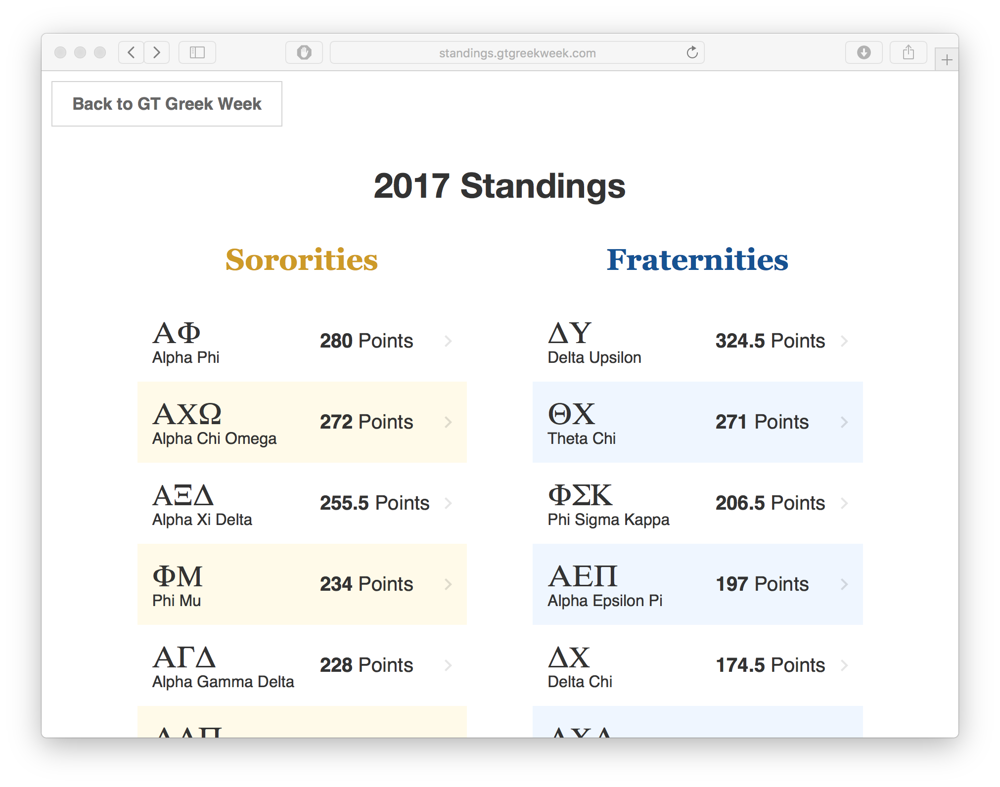

## Greek-Week-Standings
A responsive web app to present chapter points and overall standings for Georgia Tech Greek Week. 

You can run run the site locally to make changes by using `$ python -m SimpleHTTPServer 8000` and then opening `localhost:8000` in your browser.

### Desktop

     

### Mobile (Responsive web)

     
    

